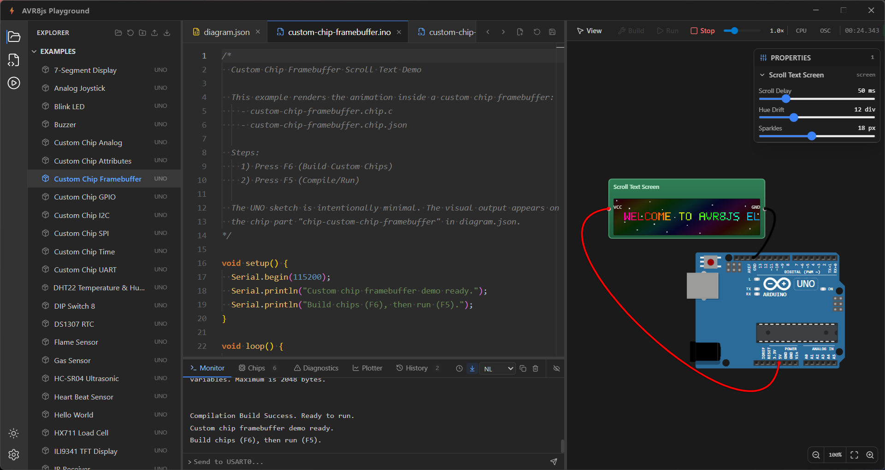

# AVR8js Electron Playground

An [AVR8js](https://github.com/wokwi/avr8js) and [Wokwi Elements](https://github.com/wokwi/wokwi-elements) playground implemented with [Electron](https://github.com/electron/electron).

To run this application:

1. Install dependencies: `npm install`
2. Build with TypeScript: `npm run build`
3. Start the app: `npm start`

To run dev:

1. Run dev: `npm run dev`

## License

AVR8js & Wokwi Elements are released under the [MIT license](https://github.com/wokwi/avr8js/blob/master/LICENSE).

Electron are released under the [MIT license](https://github.com/electron/electron/blob/master/LICENSE)

Monaco Editor are released under the [MIT license](https://github.com/microsoft/monaco-editor/blob/main/LICENSE.md)

When using the Electron or other GitHub logos, be sure to follow the [GitHub logo guidelines](https://github.com/logos).
