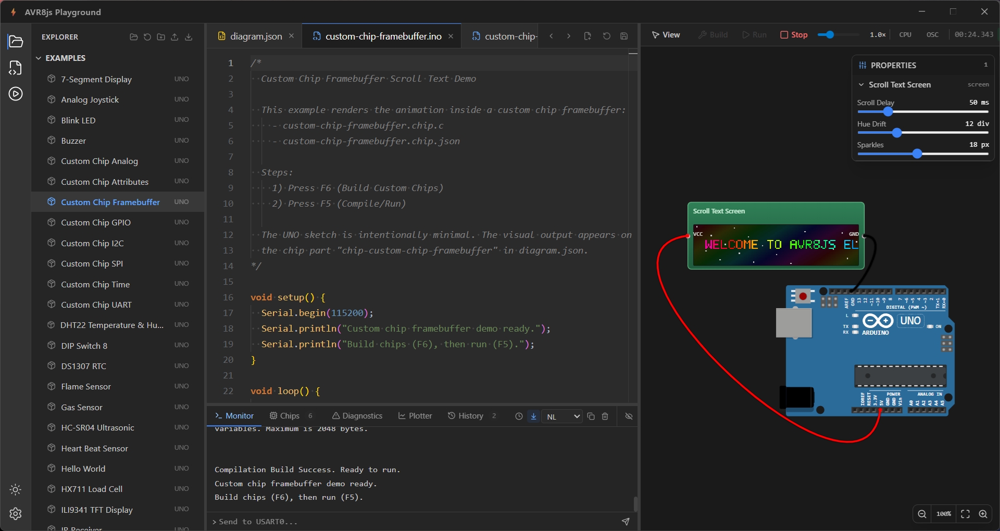

# AVR8js Electron Playground

A full-featured **Arduino simulator** built with [AVR8js](https://github.com/wokwi/avr8js), [Wokwi Elements](https://github.com/wokwi/wokwi-elements), and [Electron](https://github.com/electron/electron). Write Arduino code, design circuits visually, and simulate everything in real time — all offline in a native desktop application.



---

## Features

### Code Editor
- **Monaco Editor** (VS Code engine) with custom dark theme optimized for C/C++ and JSON
- Syntax highlighting, autocomplete, find & replace, context menus
- Tab-based multi-file editing (`.ino` + `diagram.json`)
- Font size 15px / line height 24px for comfortable reading

### Visual Simulator
- **49 Wokwi components** available in the component catalog
- Drag-and-drop component placement with pan/zoom canvas
- Visual wire routing with color selection and catenary physics
- Pin tooltip overlay showing pin names on hover
- Real-time GPIO state visualization

### Simulation Engine
- Full **ATmega328p** CPU emulation (avr8js): timers, ports, USART, SPI, TWI, EEPROM, ADC
- Cloud compilation via [Hexi (Wokwi)](https://hexi.wokwi.com) — no local toolchain needed
- Real-time simulation speed and elapsed time display
- Serial Monitor with bidirectional communication (send/receive)

### Supported Components

| Category | Components |
|----------|-----------|
| **Boards** | Arduino Uno, Nano, Mega, ESP32 Devkit, Franzininho, Nano RP2040 |
| **Output** | LED, RGB LED, Buzzer, Relay, LED Bar Graph, 7-Segment, Servo, Stepper Motor |
| **Display** | LCD 1602 (I2C), LCD 2004 (I2C), SSD1306 OLED (I2C), ILI9341, NeoPixel, NeoPixel Matrix, LED Ring |
| **Input** | Pushbutton, Pushbutton 6mm, Slide Switch, Tilt Switch, DIP Switch 8, Membrane Keypad, Rotary Encoder (KY-040), Rotary Dialer, Analog Joystick |
| **Analog** | Potentiometer, Slide Potentiometer |
| **Sensors** | DHT22, HC-SR04, NTC Temperature, Photoresistor, Flame, Big/Small Sound, PIR Motion, Heart Beat, Gas Sensor, MPU6050, HX711 |
| **Communication** | IR Receiver, IR Remote, DS1307 RTC, microSD Card |
| **Passive** | Resistor |

### GPIO Routing (26 handlers)
All wired connections in `diagram.json` are automatically routed between Arduino pins and components:
- **Digital Output**: LED, RGB LED, Buzzer, Relay, LED Bar Graph, 7-Segment
- **Digital Input**: Pushbutton, Slide Switch, Tilt Switch, DIP Switch
- **Analog Input**: Potentiometer, Slide Potentiometer, Analog Joystick (ADC binding)
- **Sensors**: NTC (analog), Photoresistor/Flame/Sound (analog+digital), PIR/Heartbeat (digital)
- **Scan Matrix**: Membrane Keypad (row/column scanning)
- **Encoder**: Rotary Encoder (quadrature CLK/DT/SW)
- **PWM Output**: Servo (pulse width to angle), Stepper Motor (4-phase)
- **Dialer**: Rotary Dialer (pulse train)

### I2C Bus
- LCD 1602 (address `0x27`)
- LCD 2004 (address `0x27`)
- SSD1306 OLED (addresses `0x3C`, `0x3D`)
- DS1307 RTC (address `0x68`)

### Serial Monitor
- Full-duplex serial communication with the simulated Arduino
- Line ending options: Newline, Carriage Return, Both, None
- Timestamp toggle for incoming messages
- Auto-scroll with manual override
- Copy and clear controls

### Component Property Editor
- Live adjustable sliders for sensor values during simulation
- Supported: DHT22 (temperature/humidity), HC-SR04 (distance), NTC (temperature), Photoresistor (light level), Flame/Sound/PIR/Heartbeat sensors

### Diagram Editor
- Add/remove components visually
- Wire color picker with 12 color options
- Undo/Redo with Ctrl+Z / Ctrl+Y (up to 100 history states)
- Auto-save diagram to disk (1-second debounce)
- Manual diagram.json editing synced with visual editor

### Project Management
- Auto-discovery of example projects organized by difficulty (beginner / intermediate / advanced)
- Project export/import as `.avr8js` JSON bundles
- Zustand-based global state management

### Layout
- 1920x1080 native resolution with custom frameless titlebar
- VS Code-inspired dark theme with resizable split panels
- Toggle sidebar, editor, and simulator independently
- Activity bar with quick toggles

---

## Tech Stack

| Technology | Version | Purpose |
|-----------|---------|---------|
| Electron | 40.6.0 | Desktop shell |
| React | 19 | UI framework |
| TypeScript | 5.9 | Type safety |
| Vite | 7 | Build tool & bundler |
| avr8js | 0.21.0 | ATmega328p CPU emulator |
| @wokwi/elements | 1.9.1 | Circuit component web elements |
| Monaco Editor | 0.55.1 | Code editor |
| Zustand | 5 | State management |
| Tailwind CSS | 3.4 | Styling |
| Split.js | 1.6 | Resizable panels |
| Lucide React | 0.575 | Icon library |
| ESLint | 9 | Linting (0 errors) |
| Vitest | 4 | Testing |

---

## Getting Started

### Prerequisites
- [Node.js](https://nodejs.org/) 18+
- npm

### Install & Run

```bash
# Clone the repository
git clone https://github.com/arcostasi/avr8js-electron.git
cd avr8js-electron

# Install dependencies
npm install

# Development (build + launch)
npm run dev

# Or build and start manually
npm run build
npm start
```

### Scripts

| Script | Description |
|--------|-------------|
| `npm run dev` | Build and launch in development mode |
| `npm run build` | Compile TypeScript + Vite build |
| `npm start` | Launch the Electron app |
| `npm run lint` | Run ESLint on all source files |
| `npm run lint:fix` | Auto-fix lint issues |

---

## Project Structure

```
avr8js-electron/
├── index.html                  # Electron renderer entry
├── vite.config.ts              # Vite build configuration
├── tsconfig.json               # TypeScript configuration
├── eslint.config.mjs           # ESLint flat config
├── tailwind.config.cjs         # Tailwind CSS configuration
├── examples/                   # Built-in example projects
│   ├── beginner/               #   hello-world (blink LED)
│   ├── intermediate/           #   matrix8x8, matrix16x16, neopixel-matrix, ssd1306
│   └── advanced/               #   mega-6502 (6502 CPU emulator)
├── src/
│   ├── main/                   # Electron main process
│   │   └── main.ts             #   Window creation, IPC handlers
│   ├── electron/               # IPC infrastructure
│   │   ├── ipc-app.ts          #   App bootstrap
│   │   ├── ipc-channel.ts      #   Channel interface
│   │   ├── ipc-request.ts      #   Request types
│   │   ├── ipc-service.ts      #   Service base class
│   │   └── info-channel.ts     #   System info channel
│   ├── renderer/               # React UI (renderer process)
│   │   ├── App.tsx             #   Root component
│   │   ├── index.tsx           #   React mount point
│   │   ├── index.css           #   Global styles
│   │   ├── components/
│   │   │   ├── Editor.tsx      #   Monaco code editor
│   │   │   ├── ProjectSidebar.tsx
│   │   │   ├── SerialMonitor.tsx
│   │   │   └── simulator/
│   │   │       ├── WokwiSimulator.tsx
│   │   │       ├── PartRenderer.tsx
│   │   │       ├── SimulatorToolbar.tsx
│   │   │       ├── AddComponentMenu.tsx
│   │   │       ├── CanvasZoomControls.tsx
│   │   │       ├── PinOverlay.tsx
│   │   │       ├── PinTooltip.tsx
│   │   │       ├── WireLayer.tsx
│   │   │       ├── WireColorPopup.tsx
│   │   │       └── ComponentPropertyEditor.tsx
│   │   ├── hooks/
│   │   │   ├── useSimulation.ts
│   │   │   ├── useDiagramState.ts    # Undo/redo history
│   │   │   ├── useAutoSave.ts
│   │   │   ├── useCanvasInteraction.ts
│   │   │   ├── usePinPositions.ts
│   │   │   ├── useResizableLayout.ts
│   │   │   └── useWireRenderer.tsx
│   │   ├── services/
│   │   │   ├── gpio-router.ts        # 26 component GPIO handlers
│   │   │   ├── simulation-engine.ts   # I2C, NeoPixel, sensor factory
│   │   │   ├── project-loader.ts
│   │   │   ├── project-export.ts
│   │   │   └── netlist-builder.ts
│   │   ├── store/
│   │   │   └── projectStore.ts       # Zustand global state
│   │   ├── constants/
│   │   │   └── wokwi-components.ts   # 49 component catalog
│   │   ├── types/
│   │   │   └── wokwi.types.ts        # Diagram schema + V1→V2 migration
│   │   └── utils/
│   │       ├── catenary.ts           # Wire physics
│   │       └── pin-mapping.ts        # Arduino pin → AVR port mapping
│   └── shared/                 # AVR simulation core
│       ├── execute.ts          #   AVRRunner (CPU lifecycle)
│       ├── compile.ts          #   Cloud hex compilation
│       ├── adc-registry.ts     #   ADC channel management
│       ├── i2c-bus.ts          #   I2C device multiplexer
│       ├── lcd1602.ts          #   LCD 16x2 controller
│       ├── lcd2004.ts          #   LCD 20x4 controller
│       ├── ssd1306.ts          #   SSD1306 OLED controller
│       ├── ws2812.ts           #   WS2812/NeoPixel controller
│       ├── dht22.ts            #   DHT22 sensor controller
│       ├── hc-sr04.ts          #   HC-SR04 ultrasonic controller
│       ├── ds1307.ts           #   DS1307 RTC controller
│       ├── ir.ts               #   NEC IR protocol
│       ├── speaker.ts          #   Speaker/buzzer audio
│       ├── stepper.ts          #   Stepper motor controller
│       ├── eeprom.ts           #   EEPROM persistence
│       ├── intelhex.ts         #   Intel HEX parser
│       ├── format-time.ts      #   Time formatting utility
│       ├── cpu-performance.ts  #   FPS/speed measurement
│       └── task-scheduler.ts   #   Cooperative task scheduler
```

---

## Example Projects

| Project | Difficulty | Description |
|---------|-----------|-------------|
| Hello World | Beginner | Classic LED blink on pin 13 |
| Matrix 8x8 | Intermediate | NeoPixel 8x8 LED matrix animations |
| Matrix 16x16 | Intermediate | NeoPixel 16x16 LED matrix animations |
| NeoPixel Matrix | Intermediate | FastLED NeoPixel patterns |
| SSD1306 | Intermediate | OLED display with I2C |
| Mega 6502 | Advanced | 6502 CPU emulator on Arduino Mega |

---

## License

- **AVR8js** & **Wokwi Elements**: [MIT License](https://github.com/wokwi/avr8js/blob/master/LICENSE)
- **Electron**: [MIT License](https://github.com/electron/electron/blob/master/LICENSE)
- **Monaco Editor**: [MIT License](https://github.com/microsoft/monaco-editor/blob/main/LICENSE.md)

When using the Electron or other GitHub logos, be sure to follow the [GitHub logo guidelines](https://github.com/logos).
